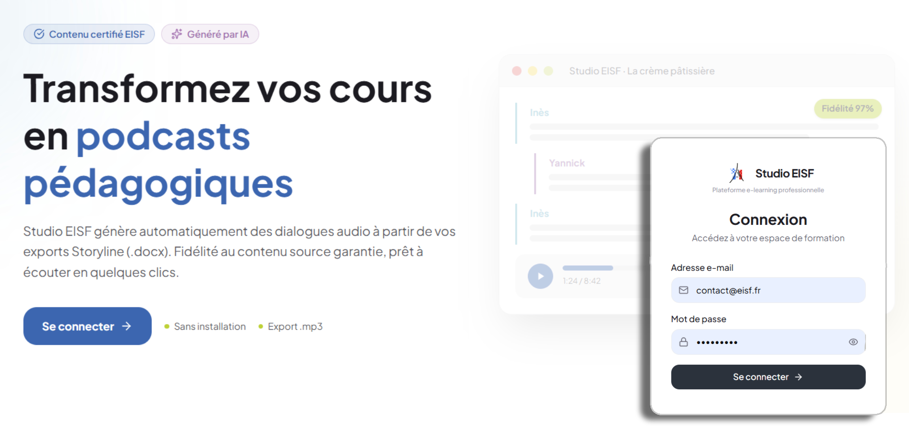
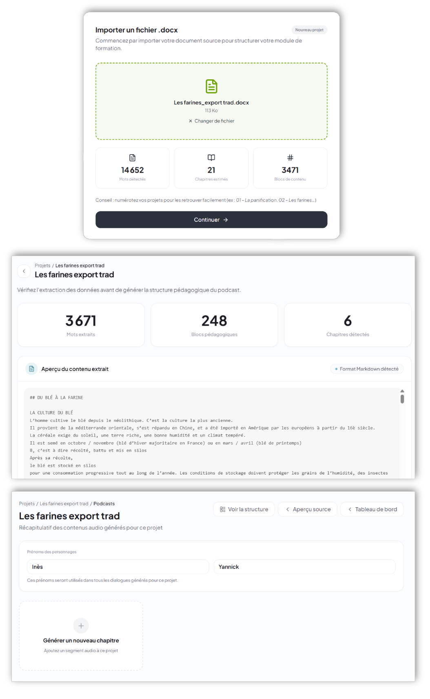
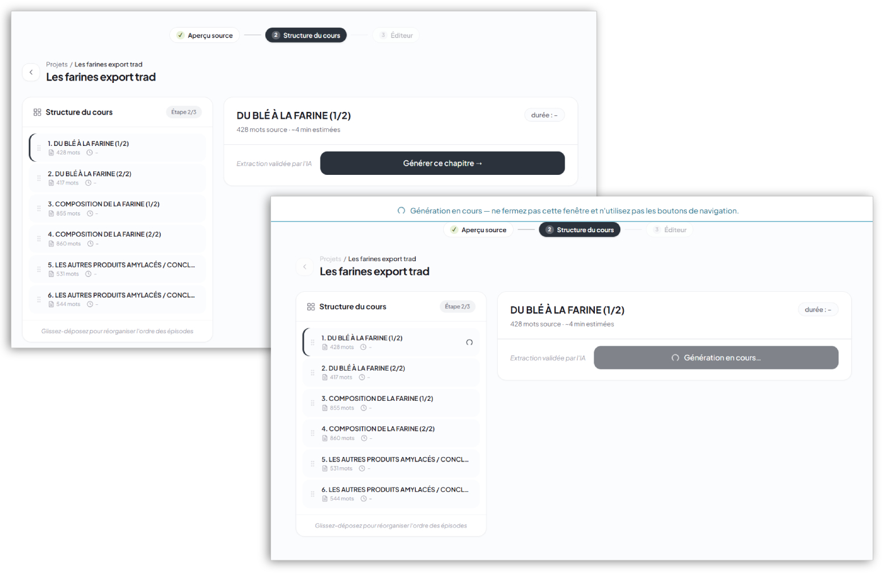
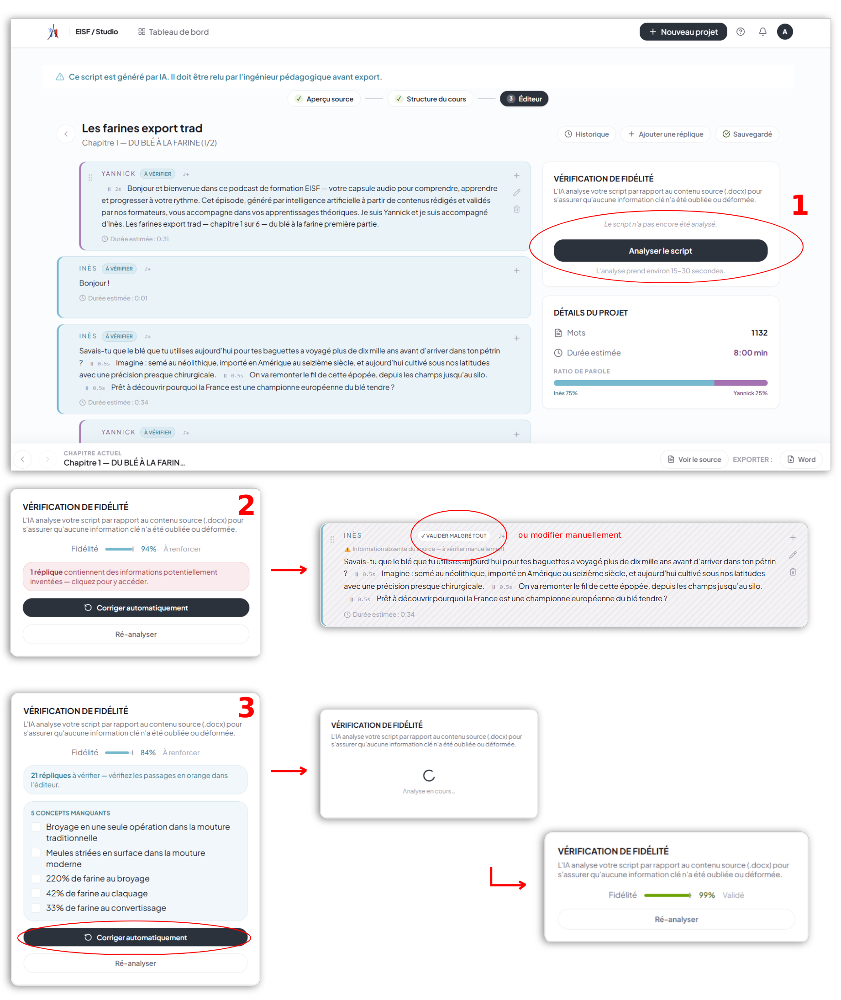
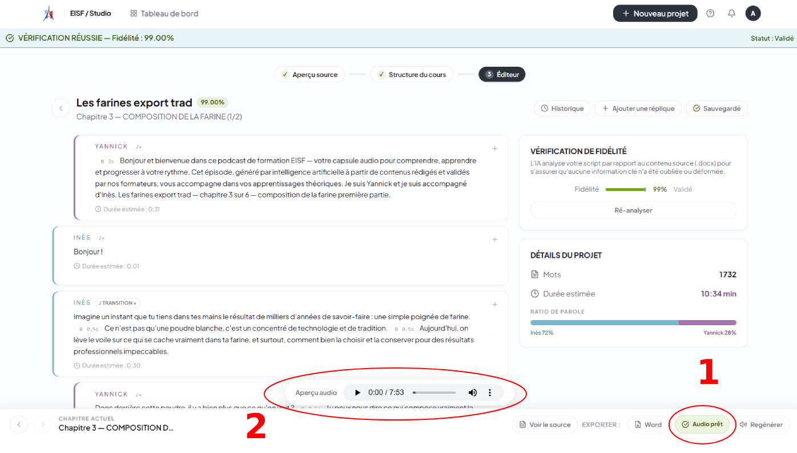
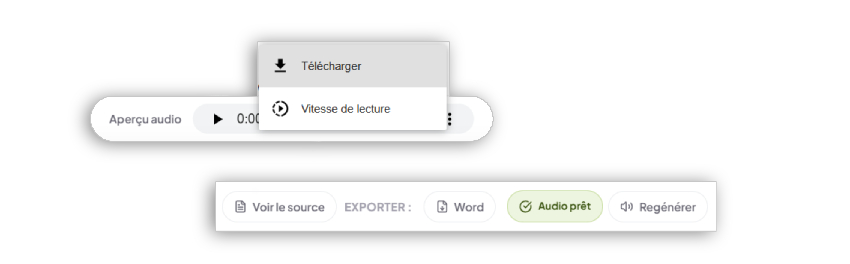

# Guide utilisateur — Studio EISF

> **Pour qui ?** Les formateurs EISF qui souhaitent transformer leurs cours Storyline en podcasts pédagogiques.
> **Prérequis :** Avoir un export `.docx` Articulate Storyline (sans images). Aucune compétence technique requise.
> **URL de l'outil :** https://en.eisf.fr/studio

---

## Table des matières

1. [Se connecter](#1-se-connecter)
2. [Importer votre cours Storyline](#2-importer-votre-cours-storyline)
3. [Générer le dialogue IA](#3-générer-le-dialogue-ia)
4. [Vérifier la fidélité au contenu](#4-vérifier-la-fidélité-au-contenu)
5. [Éditer le dialogue](#5-éditer-le-dialogue)
6. [Générer l'audio](#6-générer-laudio)
7. [Exporter le podcast](#7-exporter-le-podcast)
8. [Problèmes fréquents](#8-problèmes-fréquents)

---

## 1. Se connecter



1. Ouvrir **https://en.eisf.fr/studio** dans votre navigateur
2. Saisir l'identifiant et le mot de passe fournis par votre administrateur
3. Cliquer sur **Se connecter**

> 💡 Identifiant et mot de passe fournis par votre administrateur EISF.
> En cas de perte : contacter **contact@eisf.fr**

---

## 2. Importer votre cours Storyline


1. Sur le tableau de bord, cliquer sur **Nouveau projet**
2. Glisser votre fichier `.docx` dans la zone d'import, ou cliquer pour le sélectionner


3. L'outil détecte automatiquement les chapitres — vérifier la liste affichée



4. Donner un nom au projet et valider

> ⚠️ **Prérequis fichier :** Le fichier doit être un **export Word d'Articulate Storyline sans images** (tableau 4 colonnes : ID, Type, Texte d'origine, Traduction). Un export PDF ou un document Word classique ne fonctionnera pas.

---

## 3. Générer le dialogue IA



1. Sélectionner un chapitre dans la liste
2. Cliquer sur **Générer le dialogue**
3. Attendre la génération (30 à 60 secondes selon la longueur du chapitre)

> 💡 Le dialogue généré contient automatiquement :
> - Une **accroche** (45 secondes)
> - Le **contenu pédagogique** avec quiz intégré
> - Une **conclusion** + annonce du prochain épisode
> - L'**intro et l'outro EISF** fixes
> - Les personnages prédéfinis : **Inès** (experte, 70%) et **Yannick** (apprenant, 30%)

---

## 4. Vérifier la fidélité au contenu


Après génération, l'IA vérifie automatiquement que le dialogue respecte votre cours source.

| Score | Signification | Action |
|---|---|---|
| ✅ ≥ 95% | Fidèle au contenu source | Vous pouvez générer l'audio |
| ⚠️ < 95% | Des écarts ont été détectés | Corriger dans l'éditeur, relancer la vérification |

> 💡 Vous pouvez consulter le **contenu source** du chapitre directement depuis l'éditeur pour comparer (voir CAPTURE_10).

### Les balises [PROPOSITION]

Quand l'IA ajoute du contenu **absent de votre cours source**, elle le signale :

```
[PROPOSITION: exemple concret que j'ajoute pour illustrer]
```



- Cliquer **Garder** → l'ajout est validé
- Cliquer **Supprimer** → l'ajout est retiré

> ⚠️ La génération audio est **bloquée** tant qu'il reste des propositions non résolues.

---

## 5. Éditer le dialogue


1. Cliquer sur une réplique pour la modifier directement
2. Les modifications sont sauvegardées automatiquement
3. Relancer la vérification après toute modification importante

### Ajouter un son au début d'une réplique


Vous pouvez activer un son de transition avant certaines répliques (ex : début de section) en utilisant le bouton son disponible sur chaque réplique.

---

## 6. Générer l'audio



1. Vérifier que toutes les propositions sont résolues et le score ≥ 95%
2. Cliquer sur **Générer l'audio**
3. Attendre la synthèse vocale (1 à 3 minutes selon la durée du podcast)
4. Écouter l'aperçu dans le lecteur intégré

> 💡 Les voix utilisées sont celles d'**Inès** et **Yannick**, synthétisées par ElevenLabs.

---

## 7. Exporter le podcast



| Format | Usage |
|---|---|
| **MP3** | Podcast final à diffuser aux apprenants |
| **Word** | Dialogue écrit (usage interne) |

---

## 8. Problèmes fréquents

| Problème | Solution |
|---|---|
| Le fichier `.docx` n'est pas reconnu | Vérifier que c'est un export Storyline sans images, pas un Word classique |
| La génération échoue | Vérifier la connexion internet et relancer |
| Le score de fidélité est bas | Corriger les passages inventés dans l'éditeur, relancer la vérification |
| L'audio est coupé | Rafraîchir la page et régénérer l'audio |
| Le bouton audio est grisé | Résoudre toutes les balises [PROPOSITION] d'abord |
| Je ne me souviens plus de mon mot de passe | Contacter contact@eisf.fr |

---

## Contact & support

Problème non résolu ? **contact@eisf.fr**

---

*© 2026 EISF — École Internationale du Savoir-Faire Français. Développé par Martine Desmaroux.*
